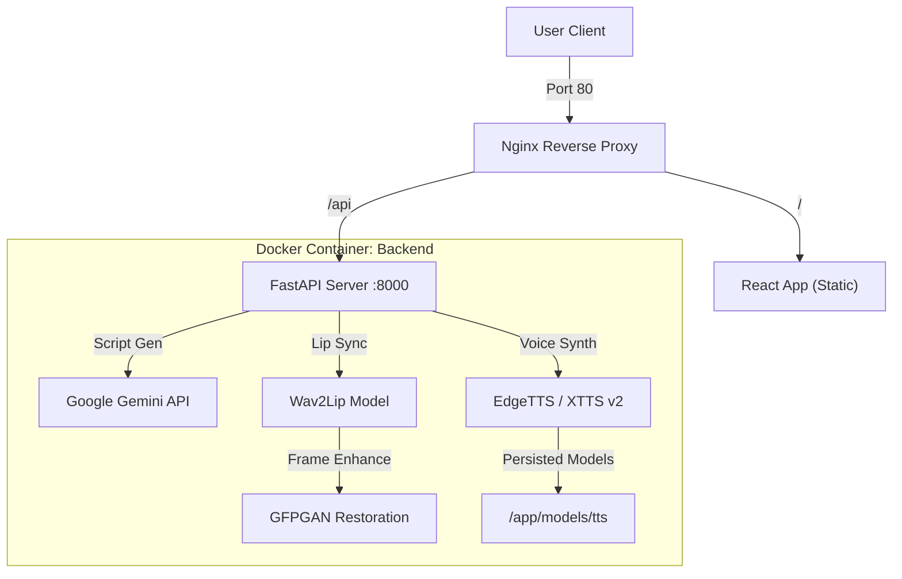

# AudioSync Studio 🎙️👄
> **A generic, AI-powered Video Lip-Sync & Voice Cloning Studio.**

AudioSync Studio is a full-stack web application that leverages state-of-the-art Generative AI models to create realistic lip-sync videos. It combines **Wav2Lip** for lip synchronization, **GFPGAN** for face restoration, **EdgeTTS/XTTS** for voice synthesis/cloning, and **Google Gemini** for script generation into a seamless, user-friendly interface.


## ✨ Key Features

*   **🎭 Audio-Driven Lip Sync**: Generates high-accuracy lip movements on any video face using `Wav2Lip`.
*   **🗣️ Advanced Voice Synthesis**:
    *   **Standard**: High-quality neural voices via EdgeTTS (Azure).
    *   **Voice Cloning**: Clone any voice from a 5-second sample using **Coqui XTTS v2** (with temperature control for hallucinations).
*   **✨ Face Restoration**: Enhances output quality using `GFPGAN` to fix blurry faces in generated videos.
*   **📝 AI Script Writer**: Integrated **Gemini AI** to auto-generate professional scripts for avatars.
*   **⚡ Modern Architecture**: Dockerized microservices with FastAPI (Backend), React (Frontend), and Nginx (Proxy).

## 🏗️ System Architecture



## 🛠️ Tech Stack

*   **Frontend**: React (TypeScript), TailwindCSS, Framer Motion, Lucide Icons.
*   **Backend**: Python, FastAPI, Uvicorn, Celery (Future).
*   **AI/ML**: PyTorch (CUDA), Wav2Lip, GFPGAN, Coqui XTTS v2, Google Gemini.
*   **DevOps**: Docker, Docker Compose, GitHub Actions (CI).

## 🚀 Installation & Setup

### Prerequisites
*   **Docker Desktop** (Recommended)
*   **Git**
*   **NVIDIA GPU** (Optional but highly recommended for speed)

### method 1: Docker (Recommended)

This method ensures all dependencies (FFmpeg, CUDA, PyTorch, Coqui TTS) work out of the box without "Dependency Hell".

1.  **Clone the Repository**
    ```bash
    git clone https://github.com/yourusername/AudioSync-Studio.git
    cd AudioSync-Studio
    ```

2.  **Configuration**
    *   Create a `.env` file in the root directory (optional but recommended for Gemini):
        ```env
        GEMINI_API_KEY=your_gemini_api_key_here
        ```

3.  **Build and Run**
    ```bash
    docker-compose up --build
    ```
    *   *First run will take time to download the base PyTorch image (~2GB) and build extensions.*
    *   *XTTS Models (~2GB) will be downloaded to `./models/tts` locally on the first use of Voice Cloning.*

4.  **Access the App**
    *   Open [http://localhost](http://localhost) in your browser.

### Method 2: Local Development (Windows/Linux)

If you prefer running without Docker:

1.  **Backend Setup**
    ```bash
    python -m venv venv
    .\venv\Scripts\activate   # or source venv/bin/activate
    
    # Install Dependencies
    pip install -r requirements.txt
    
    # Install PyTorch with CUDA support manually if needed
    pip install torch torchvision torchaudio --index-url https://download.pytorch.org/whl/cu118
    ```

2.  **Frontend Setup**
    ```bash
    cd frontend
    npm install
    npm run dev
    ```

3.  **Run Server**
    ```bash
    uvicorn backend.server:app --reload --host 0.0.0.0
    ```

## 🧠 Models Used

| Model | Purpose | Source |
|-------|---------|--------|
| **Wav2Lip** | Lip Synchronization | Pre-trained checkpoint included in `models/Wav2Lip` |
| **XTTS v2** | Voice Cloning | Downloaded auto-magically from Coqui AI |
| **EdgeTTS** | Standard Voice | Microsoft Edge Cloud API (Free) |
| **GFPGAN** | Face Restoration | Downloaded auto-magically on first use |
| **Gemini Pro** | Script Writing | Google AI Studio API |

## 🤝 Contributing

1.  Fork the repository
2.  Create a feature branch (`git checkout -b feature/AmazingFeature`)
3.  Commit your changes (`git commit -m 'Add some AmazingFeature'`)
4.  Push to the branch (`git push origin feature/AmazingFeature`)
5.  Open a Pull Request

## 📄 License

Distributed under the MIT License. See `LICENSE` for more information.

---

## ⭐️ Give it a Star

If you found this repo helpful or interesting, please consider giving it a ⭐️. It motivates me to keep learning and sharing!

---
