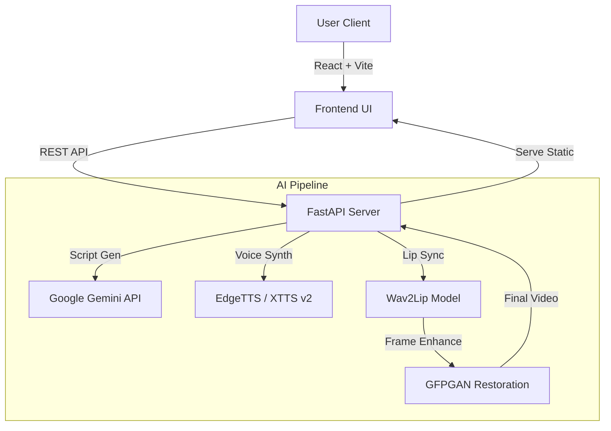

# AudioSync Studio 🎙️👄
> **A generic, AI-powered Video Lip-Sync & Voice Cloning Studio.**

AudioSync Studio is a full-stack web application that leverages state-of-the-art Generative AI models to create realistic lip-sync videos. It combines **Wav2Lip** for lip synchronization, **GFPGAN** for face restoration, **EdgeTTS/XTTS** for voice synthesis/cloning, and **Google Gemini** for script generation into a seamless, user-friendly interface.


## ✨ Key Features

*   **🎭 Audio-Driven Lip Sync**: Generates high-accuracy lip movements on any video face using `Wav2Lip`.
*   **🗣️ Advanced Voice Synthesis**:
    *   **Standard**: High-quality neural voices via EdgeTTS (Azure).
    *   **Voice Cloning**: Clone any voice from a 5-second sample using **Coqui XTTS v2**.
*   **✨ Face Restoration**: Enhances output quality using `GFPGAN` to fix blurry faces in generated videos.
*   **📝 AI Script Writer**: Integrated **Gemini AI** to auto-generate professional scripts for avatars.
*   **⚡ Real-time Architecture**: Built with FastAPI for high-performance inference and React for a responsive UI.

## 🏗️ System Architecture



## 🛠️ Tech Stack

*   **Frontend**: React (TypeScript), TailwindCSS, Framer Motion, Lucide Icons.
*   **Backend**: Python, FastAPI, Uvicorn.
*   **AI/ML**: PyTorch, Wav2Lip, GFPGAN, Coqui TTS, Google Gemini API.
*   **DevOps**: Virtual Environment management (future: Docker).

## 🚀 Installation & Setup

### Prerequisites
*   Python 3.10+ (Recommended)
*   Node.js & npm
*   NVIDIA GPU (Recommended for faster inference)
*   Visual C++ Build Tools (for XTTS)

### 1. Backend Setup

```bash
# Clone the repository
git clone https://github.com/yourusername/AudioSync-Studio.git
cd AudioSync-Studio

# Create Virtual Environment
python -m venv venv
.\venv\Scripts\activate

# Install Dependencies (may take a while)
pip install -r requirements.txt

# Install specific torch version if needed (CUDA 11.8 example)
pip install torch torchvision torchaudio --index-url https://download.pytorch.org/whl/cu118
```

### 2. Frontend Setup

```bash
cd frontend
npm install
```

### 3. Running the App

 **Option A: One-Click Start (Windows)**
Run `start_app.bat`

**Option B: Manual Start**
*Backend*:
```bash
uvicorn backend.server:app --reload --host 0.0.0.0
```
*Frontend*:
```bash
npm run dev
```

## 📖 Usage Guide

1.  **Select Avatar**: Upload a video or image of a face.
2.  **Generate Audio**:
    *   Type text manually.
    *   Use **AI Script Writer** to generate content.
    *   Choose a generic voice or **Clone a Reference Voice**.
3.  **Process**: Click "Sync Audio & Video".
    *   Toggle **GFPGAN** for higher quality (slower).
4.  **Download**: View and download your result.

## 📂 Project Structure

```
AudioSync-Studio/
├── backend/            # FastAPI Server
├── frontend/           # React Application
├── src/                # Core AI Logic (Wav2Lip, TTS)
├── models/             # Pre-trained checkpoints
├── data/               # Temp storage for uploads/results
└── requirements.txt    # Python dependencies
```

---
*Created for Portfolio Demonstration.*